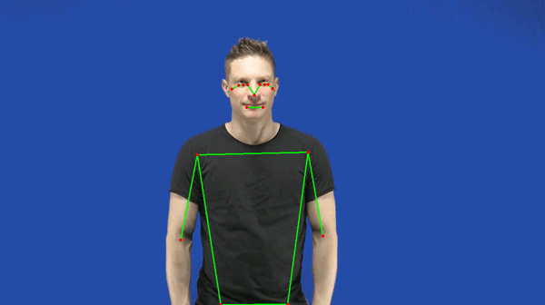
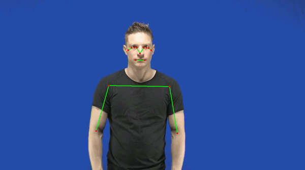

  


## Info documents

* location Repository:  https://github.com/WimPouw/EnvisionBootcamp2021

* location Rmarkdown: https://github.com/WimPouw/EnvisionBootcamp2021/blob/main/R/GestureNetworks_module1/gesturenetworks_module1.Rmd

* citation: Pouw, W. & Trujillo, J. P. (`r Sys.Date()`). *Gesture Networks Module 1: Computing kinematic distances using dynamic time warping*. [the day you viewed the site]. Retrieved from: https://wimpouw.github.io/EnvisionBootcamp2021/gesturenetworks_module1.html

```{r setup, include=FALSE}
knitr::opts_chunk$set(echo = TRUE)

#packages
library(dtw)         #for dynamic time warping
library(rjson)       #for extracting json info
library(stringr)     #for manipulations of strings
library(ggplot2)     #plotting
library(plotly)     #plotting
library(htmltools)       #for dimensionality reduction

#set current as working drive via session -> set working drive -> source file location
workingdrive <- getwd() 
basefolder   <- dirname(workingdrive)
timeserfolder <- paste0(basefolder, "/TimeSeries/")
distancematfolder <- paste0(basefolder, "/Distance_matrices/")
iconicityratings <- read.csv(paste0(basefolder, "/IconicityRatings/Iconicity_ratings.csv"))
```

## Background

Human (communicative) body movements are often recurrent, such that they use similar shapes or trajectories to convey or act on something consistently. How can we make sense of the variability and consistency with which movement events are produced over events within a set? One way to do this is by quantifying the similarities present between all the movement events that are produced. Once we have documented how similar each movement event is relative to all other events we can then visualize and quantify the structure of these interrelationships and discover novel patterns that exist over the entire set of behaviors. For example, in previous work we have found that when communicative silent gestures have been practiced and communicated more, those silent gestures start to change their interrelationships in consistent ways (e.g., the kinematic space reduces in complexity) (see [3] Pouw, Dingemanse, Motamedi, Ozyurek, 2021).

Note that this particular procedure outlined here, is introduced in [1] Pouw & Dixon (2020) and we advise you to read this first before starting (or [3]). The main procedure: we compute some distance measure between two N-dimenionsal time series i and j, and do this for all events n. Similar to previous work [1] we will use dynamic time warping (see [2] Giorgino, 2009) as the distance calculation. We then compute what is called a distance matrix (M) which has *n* rows and *n* columns containing for each cell M[*i*,*j*] the distance score between movement *i* and *j*. Then we can use dimensionality reduction techniques (e.g., classic multidimenionsal scaling, t-sne, UMAP) to visualize in 2-dimensional space the interrelationships between all movement events (we will use classic multidimensional scaling).

For the current movement events we use a set of silent gestures produced by an actor conveying certain concepts (open dataset by: [4][Ortega & Ozyurek, 2020). We extracted the movement information using mediapipe body tracking for each silent gesture, and this is the input of our procedure. Note that the current procedure can be applied on any signal (e.g., acoustic trajectories) and also on multiple persons that are producing movement events.

## Overview processing steps

This markdown file contains the following processing steps.

* Create a distance matrix with dynamic time warping distances

* Visualize the distance matrix in a 2D space

* Some application: Do ratings of iconicity of a particular gesture depend on the interrelationships of that gesture?

The folder 'Time_series' is filled with mediapipe body tracking time series for each video. We extract from it, nose, elbow, index finger (x , y, z) info (for both hands). Figure 1 shows an example of the kinematic time series for the silent gesture "TO-SWIM" which is also shown below. The swimming gesture has a characteristic rhythmic movement, as reflected in the oscillating movements in the horizontal dimension for left and right index finger. 

Figure 1. Example raw time series of SWIMMING for the right (red) and left hand (in blue)
```{r}
MT <- read.csv(paste0(timeserfolder, "TO-SWIM_silentgesture.csv"))

a <- ggplot(MT, aes(x = time)) + 
                  geom_path(aes(y = X_RIGHT_INDEX), color = "red") + 
                  geom_path(aes(y = X_LEFT_INDEX), color = "blue") + 
                  theme_bw()+ylab("horizontal\nposition normalized")
ggplotly(a)
```
  


## Main routine: constructing a distance matrix

The next step is to compute a average dynamic time warping distance between joint position traces. This means we are performing a dependent DTW, where x,y,z time series are submitted for a gesture i and gesture event j; we take the mean distances over each joint comparison (nose, wrist etc.).

Script procedure 2. This loop makes a distance matrix
```{r, DTW, eval = FALSE}
timeseriess <- list.files(timeserfolder)

#########################FUNCTIONS

#dtw forward backward with free begin-and-end constraints
keypointsindex_right <- which(colnames(MT) %in% c("X_RIGHT_INDEX", "Y_RIGHT_INDEX", "Z_RIGHT_INDEX"))
keypointsindex_left <- which(colnames(MT) %in% c("X_RIGHT_INDEX", "Y_RIGHT_INDEX", "Z_RIGHT_INDEX"))
keypointselbow_right <- which(colnames(MT) %in% c("X_RIGHT_ELBOW", "Y_RIGHT_ELBOW", "Z_RIGHT_ELBOW"))
keypointselbow_left <- which(colnames(MT) %in% c("X_LEFT_ELBOW", "Y_LEFT_ELBOW", "Z_LEFT_ELBOW"))
keypointsnose <- which(colnames(MT) %in% c("X_NOSE", "Y_NOSE", "Z_NOSE"))

#Summed DTW
DTW.compare <- function(TS1, TS2)
{
  #perform the dynamic time warping backwards and forwards, extract the distance, and then average
  distancedtw <-  mean(dtw(TS1[keypointsindex_right], TS2[keypointsindex_right])$normalizedDistance,
                      dtw(TS1[keypointsindex_left], TS2[keypointsindex_left])$normalizedDistance,
                      dtw(TS1[keypointselbow_right], TS2[keypointselbow_right])$normalizedDistance,
                      dtw(TS1[keypointselbow_left], TS2[keypointselbow_left])$normalizedDistance,
                      dtw(TS1[keypointsnose], TS2[keypointsnose ])$normalizedDistance)
  return(distancedtw)
}


#########################MAIN ROUTINE
  #initialize some variables
  numges <- length(timeseriess) #how many gestures (should be 110)
  distmat <- matrix(nrow=numges, ncol=numges)  #110x110 matrix
  catchnames <- vector() #get the names so that we know what columns/rows belong to which ID
  n <- 0
    #loop through all combinations and save DTW score
    for(ts1 in timeseriess) #loop through i
    {
      TS1 <- read.csv(paste0(timeserfolder, ts1)) #read first time series
      TS1index <- which(timeseriess == ts1) #index of this gesture
      catchnames <- c(catchnames, substr(ts1,1,nchar(ts1)-4)) #save the gesture ID
      #some progress statement
          #loop through j
          for(ts2 in timeseriess)
          {
          TS2index <- which(timeseriess == ts2) #index of this gesture
            if(is.na(distmat[TS2index,TS1index])) #pass only if calculation has not been done
            {
            TS2 <- read.csv(paste0(timeserfolder, ts2)) #read second time series
            #compute DTW and save into matrix
            dtwoutput <- DTW.compare(TS1, TS2)
            distmat[TS1index,TS2index] <- dtwoutput
            distmat[TS2index,TS1index] <- dtwoutput #its a symmetrical result so fill two cells
          }
      }
    }
    colnames(distmat) <- catchnames #attach the names to the distance matrix
  #save the distance matrix
  write.csv(distmat,paste0(distancematfolder, "distance_matrix.csv"), row.names = FALSE)

```


## Visualizing interrelationships between movement/gesture events

Now that we have produced a distance matrix containing all the dynamic time warping distances between the silent gestures, we can visualize how these gestures relate to one another. We do this by applying a dimensionality reduction technique to visualize the high-dimensional distance matrix into a 2D space using t-sne. We can now inspect some of the nodes. For example if we look up the gesture Accordian and Butterfly we see that both are judged by the current procedure to be very similar in nature as they are close in the kinematic space. Indeed, as seen in the gestures shown below these gestures are highly similar in nature.

```{r, message = FALSE, warning = FALSE, fig.width=10, fig.height=10}
distmat <- read.csv(paste0(distancematfolder, "distance_matrix.csv"))
#plot distances
plot.space <- function(top, title,cluster1, sizepoint)
{
  top <- cbind.data.frame(top, cluster1)
  colnames(top) <- c("Xpos", "Ypos", "grouping")
  pl <- ggplot(top, aes(x= Xpos, y = Ypos, color =grouping)) + geom_point(size= sizepoint, alpha= 0.5)+theme(legend.position = "none")
  pl <- pl+  theme_bw() + ggtitle(title) + xlab("D1") + ylab("D2")
  return(pl)
}

#plot the distance matrix
set.seed(1)
topology <- cmdscale(as.matrix(log(distmat+1))) #we do a log(x+1) transform because the distances are long-tailed distributed
#plot the tsne 
ggplotly(plot.space(topology, "distances represented through classic mds", colnames(distmat),10))
```




## Animated Visualisations

But we can do even better! We can position all gesture .gif files that we have in our Images folder, and position them according to the scaled coordinates of the multidimensional scaling of the distance matrix. In this way we can directly inspect whether the kinematic distances make sense when looking at the gesture.

```{r}
library(stringr) #for string manipulation
library(scales)  #for rescaling 

distmat <- read.csv(paste0(distancematfolder, "distance_matrix.csv")) #read in the distance matrix
topology <- as.data.frame(cmdscale(as.matrix(log(distmat+1)))) #multidimenionsal scaling of the logarithmically transformed distance matrix
topology[,1:2] <- apply(topology[,1:2], 2, FUN=function(x)scales::rescale(x, from=range(x), c(0, 1300))) #lets rescale the toplogy from 0 to 600 pixels
nams <- colnames(distmat)
topology$nams <- stringr::str_replace_all(nams, "[.]", "-") #make sure names are the same as the video (so no "." but "-")

todraw <- ""
layer = 1
adjustright = 300
adjustvertical = -100
#we are only showing 25% of the videos, otherwise it is very crowded
for(nam in topology$nams[1:(length(topology$nams)/3)])
{
todraw <- paste0(todraw, paste0(''))
layer <- layer+1
}
fileConn<-file("./animated_kinematicspace.html") #save to a seperate html file
writeLines(todraw, fileConn)
close(fileConn)
```

For the result of this see here: https://wimpouw.github.io/EnvisionBootcamp2021/animated_kinematicspace.html

## Things to consider
There are many different things that you can tweak with this general gesture network procedure. For example, you can expand the gesture set to comprise gestures of multiple individuals. Other things to consider are when you care about the general shape of a gesture but not its scaled size. Then you might want to normalize (e.g., z-scale) the time series first. Also consider, we now only take a few keypoints that do not capture much of the handshape, so you can consider adding relevant timeseries for the hand shape. Further, what if you have a gesture consisting of multiple elements, and you want to judge another gesture as similar when it has elementsr regardless of the order of the items? Then you might not want to use dynamic time warping as it will judge a time series with elements a-b-c to be completely different from a time series with elements c-b-a (a possible time series distance measure that does judge such time series to be similar is matrix profile distance or MPdist). Further there are a range of settings that optimize dynamic time warping performance such as not allowing the distance error calculation to be based on the begin and trailing portions of the time series (for further references see e.g., Pouw & Dixon, 2020; Pouw et al., 2021).

## Applications
This open dataset by Ortega and Oyzyrek (2020) also has information about how each gesture was rated for its iconicity (how well the gesture represents its referent). Since we now have information about how each gesture relates to other gestures, we can for example ask whether gestures that are more differientable from other gestures will also likely be seen as more iconic;  after all, the gesture is less to be confused with others. We can do all kinds of more fancy operations to characterize how a particular gesture relates to other gestures (see for example Pouw et al., 2021), but for now we will keep it simple. Namely, what is the average kinematic distance of a gesture (higher average distance = more differentiable?) and what was the mean iconic rating for that gesture. Below we show this in a plot. It seems that gestures that have generally higher kinematic distances between other gestures, are also are more likely to be found more iconic (i.e., more transparent in meaning).

```{r, message = FALSE, warning = FALSE, fig.width=10, fig.height=10}
diag(distmat) <- NA #lets ignore the diagonals
#the distances are long-tailed distributed so we will logtransform it by log(x+1)
distmatl <- log(distmat+1) 

#compute the average distance of a gesture with all others
avdist <- apply(distmatl, 2, FUN = function(x)mean(x,na.rm=TRUE))
#collect the names of the gestures (ignoring the last bit of the string)
nam <- substr(colnames(distmatl), 1, nchar(colnames(distmatl))-14)
distsum <- cbind(nam, avdist) #combine in one matrix
#merge our summarized distance data with the iconicity ratins
mergedc <- merge(iconicityratings, distsum, by.x="English", by.y="nam")
mergedc$avdist <- as.numeric(mergedc$avdist) #make sure that avdist is a numeric variable 

#plot the relation
ggplot(mergedc, aes(x= MEAN, y = avdist))+geom_point(size=3)+geom_smooth(method="lm", size = 3)+theme_bw()+
  xlab("iconicity")+ylab("average distance")
```


## References
1. [Pouw, W. , & Dixon, J. A. (2020). Gesture networks: Introducing dynamic time warping and network analysis for the kinematic study of gesture ensembles. Discourse Processes, 57(4), 301-319. doi: 10.1080/0163853X.2019.1678967](https://wimpouw.com/pouwdixon2019_DiscP.pdf)
2. [Giorgino, T. (2009). Computing and visualizing dynamic time warping alignments in R: the dtw package. Journal of statistical Software, 31, 1-24.](https://www.jstatsoft.org/index.php/jss/article/view/v031i07/332)
3. [Pouw, W. , Dingemanse, M., Motamedi, Y., Özyürek, A. (2021). A systematic investigation of gesture kinematics in evolving manual languages in the lab. Cognitive Science. doi (open access): 10.1111/cogs.13014](https://onlinelibrary.wiley.com/doi/epdf/10.1111/cogs.13014)
4. [Ortega, G., & Özyürek, A. (2020). Systematic mappings between semantic categories and types of iconic representations in the manual modality: A normed database of silent gesture. Behavior Research Methods, 52(1), 51-67.](https://link.springer.com/content/pdf/10.3758/s13428-019-01204-6.pdf)